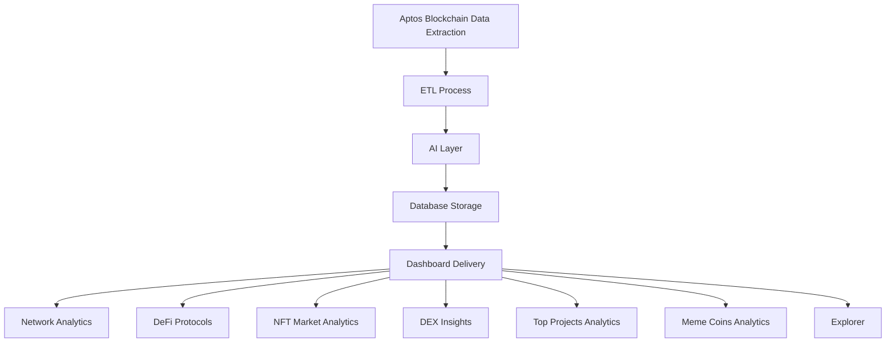

### AptosLytics: AI-Based Advanced Data Analytics for Aptos Blockchain

---

#### Overview

**AptosLytics** is an advanced AI-driven data analytics platform designed to provide comprehensive insights into the Aptos blockchain ecosystem. Our platform leverages AI agents built with large language models (LLMs) that continuously train and improve over time. These agents extract, verify, and summarize data across multiple categories in the Aptos network, offering real-time, actionable insights for developers, investors, and Aptos enthusiasts. AptosLytics delivers a holistic view of the blockchain’s landscape, addressing key metrics such as transaction volumes, NFT trends, top projects, and more.

> **Special Mention:** We are proud to acknowledge **Nodit’s Indexer API**, which powers our data extraction process. Their APIs ensure we can continuously gather, process, and present accurate Aptos blockchain data on a daily basis.

---

### Features

#### 1. **Network Analytics**

- **Comprehensive Metrics:** Gain in-depth insights into the Aptos network, including metrics such as block production, transaction volumes, and gas fees over time.
- **AI Insights:** Our AI agents summarize and analyze network metrics, providing actionable interpretations that help users make informed decisions.

#### 2. **DeFi Protocols**

The DeFi Protocols tab offers detailed analytics on the decentralized finance projects operating within the Aptos ecosystem. AptosLytics currently supports a variety of leading DeFi protocols, offering key metrics such as TVL, transaction volumes, and user activity. The following DeFi protocols are highlighted with AI-driven, in-depth analytics:

- **LiquidSwap:** Aptos' leading decentralized exchange (DEX), known for low fees and deep liquidity. AptosLytics tracks liquidity depth, trading volumes, and slippage rates, delivering valuable insights to liquidity providers and traders.
  
- **Cellana Finance:** A wallet and decentralized exchange platform integrated with Aptos. AptosLytics monitors Pontem’s adoption metrics, including user activity, transaction counts, and asset management.

- **Thala Labs:** A decentralized stablecoin platform that allows users to mint stablecoins using various collateral. AptosLytics provides detailed insights into minting volumes, collateralization ratios, and the stability of Thala Labs' ecosystem.

- **Pancake:** A derivatives trading platform built on Aptos. AptosLytics offers detailed analytics on derivatives volumes, pricing trends, and liquidity across various asset classes.
  
- **Ongoing Expansion:** We continuously expand our protocol coverage, providing detailed analysis on performance, fees, and scalability for each new DeFi protocol in the Aptos ecosystem.

#### 3. **NFT Market Analytics**

- **Market Trends:** AptosLytics tracks the latest trends in the Aptos NFT space, including trading volumes, floor prices, and market performance across various NFT collections.
- **AI-Driven Insights:** Our LLM-based agents analyze and summarize NFT market data, providing interpretations of trends and helping users identify valuable collections and potential investment opportunities.

#### 4. **DEX Insights**

- **Liquidity and Volume Analysis:** AptosLytics tracks data across major Aptos decentralized exchanges, offering detailed insights into liquidity pools, trading volumes, and fee structures.
- **AI-Driven Investment Advice:** Our AI agents analyze market trends and data to provide actionable advice, helping users make informed trading decisions on when to buy, sell, or provide liquidity.

#### 5. **Top Projects Analytics**

- **Project Tracking:** AptosLytics offers deep analytics on the most promising projects within the Aptos blockchain. This includes metrics on user adoption, token performance, and ecosystem growth.
- **AI Insights:** Our AI agents provide project-specific insights, helping users gauge the long-term potential and market positioning of each project.

#### 6. **Meme Coins Analytics**

- **Market Trends:** AptosLytics monitors the growing popularity of meme coins within the Aptos ecosystem, tracking their market performance, volume, and volatility.
- **Tailored AI Insights:** Our AI agents summarize meme coin data, offering interpretations of trends and potential investment opportunities in this high-risk, high-reward sector.

#### 7. **Explorer Tab (Graph Visualization)**

- **Graph Visualization:** AptosLytics provides graph-based visualization for exploring various activities on the Aptos blockchain, including transactions, addresses, and contracts.
- **AI-Driven Patterns:** Our AI agents highlight key patterns in blockchain activity, making it easier for users to understand data relationships and network health.

---

### Architecture

AptosLytics is built on a robust architecture designed to seamlessly extract, process, and present complex blockchain data. The following flowchart visually represents how the data flows through the system:

This flowchart demonstrates the seamless integration of the various tabs and features in AptosLytics, ensuring users receive comprehensive analytics with AI-driven insights.

---

### Meeting the Objectives

#### Aptos Blockchain Overview
- **Solution:** Our high-level dashboard aggregates data across the Aptos network, offering a detailed overview of the blockchain’s health, growth, and ecosystem activities.

#### Chain-Specific Deep Dives
- **Solution:** Users can dive deep into specific categories like DeFi, NFTs, and Meme Coins to explore transaction volumes, user activity, and project metrics. Our AI agents further clarify the data, providing easy-to-understand interpretations.

#### Comparative Analytics
- **Solution:** AptosLytics facilitates comparisons between different DeFi protocols, NFTs, and meme coins, helping users evaluate performance, liquidity, scalability, and security.

---

### Addressing the Challenges

#### Data Sources
- **Solution:** We utilize reliable data feeds and APIs, including the **Nodit’s Indexer API**, ensuring that AptosLytics continuously receives accurate, real-time data.

#### Usability
- **Solution:** AptosLytics is designed with a user-friendly interface, providing an easy-to-navigate experience for both technical and non-technical users.

#### Real-time Updates
- **Solution:** Our dashboard offers near real-time updates on key metrics, ensuring users stay informed on the latest developments within the Aptos blockchain ecosystem.

#### Educational Component
- **Solution:** AptosLytics provides resources and explanations to help users understand blockchain technology, DeFi, NFTs, and other areas of the Aptos network.

---

### How AptosLytics Meets User Needs

#### **For Developers:**
- **Optimized Network Insights:**
  - **Network Analytics:** Developers can access detailed metrics on transaction volumes, gas fees, and block production, helping them build more efficient dApps on the Aptos blockchain.
  - **Explorer Tab:** Developers can visualize transactions, addresses, and contracts through graph visualization, simplifying data exploration and network monitoring.
  - **Contract Analytics:** Coming soon, AptosLytics will allow developers to extract contract information and metadata, enhancing the development process.

#### **For Investors:**
- **Informed Investment Decisions:**
  - **DeFi Protocols Tab:** Provides insights into top-performing DeFi projects on Aptos, offering key metrics like TVL, transaction volumes, and user activity.
  - **NFT Analytics:** Tracks the latest trends in the Aptos NFT market, helping investors identify valuable collections and potential investment opportunities.
  - **DEX Insights:** AptosLytics analyzes data from Aptos DEXs, delivering actionable investment advice based on liquidity and trading volumes.

#### **For Aptos Enthusiasts:**
- **Monitoring Aptos Ecosystem Health:**
  - **Aptos Blockchain Overview:** Aggregates data from various sectors of the Aptos blockchain, providing a clear view of the ecosystem's overall health and growth.
  - **Real-time Updates:** Keeps users informed with frequent updates on key metrics across the Aptos blockchain.

---

**AptosLytics** meets the diverse needs of developers, investors, and Aptos enthusiasts, ensuring users can confidently navigate and leverage the insights from the Aptos blockchain. With AI-driven analytics and Nodit’s Indexer API powering our data extraction, AptosLytics offers a comprehensive, real-time view of the blockchain landscape.
